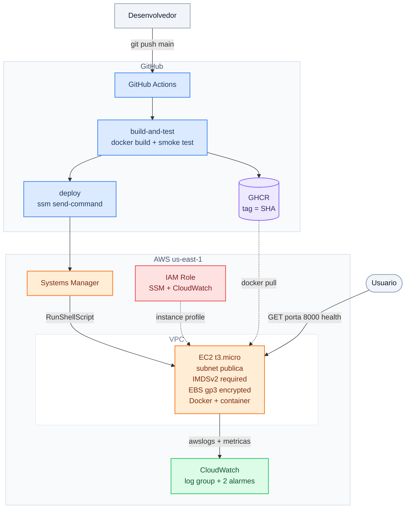

# Arquitetura — devops-01-ec2-cicd

## Fluxo

1. `git push` na `main` dispara o workflow.
2. **build-and-test**: builda a imagem, sobe o container no runner e testa
   `/health` e `POST /tasks`. Falhou, o deploy não acontece.
3. Imagem publicada no GHCR com duas tags: o SHA do commit e `latest`.
4. **deploy**: assume credenciais AWS e envia um `RunShellScript` via SSM para
   a instância — `docker pull` da tag do SHA, remove o container antigo e sobe
   o novo com o driver de log `awslogs`.
5. O job faz polling do status do comando SSM e falha se o comando falhar.
6. A instância envia logs e métricas ao CloudWatch.

## Deploy realizado via SSM

Não há porta 22 aberta e nenhuma chave SSH circula pelo pipeline. O runner do
GitHub autentica na AWS e o Systems Manager executa o comando dentro da
instância usando a identidade da IAM Role.  

A superfície de ataque some junto com a porta.